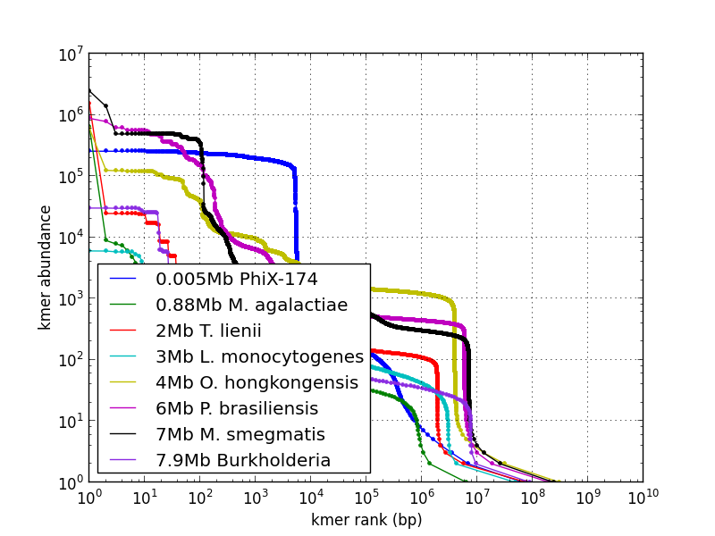

#kmerspectrumanalyzer
***

## Purpose
This package contains scripts that summarize, visualize, and 
interpret the kmer spectrum (the histogram of abundances of 
oligonucleotide patterns of fixed length) of short-read 
sequence datasets.  

This tool counts the numbers of occurrences of long kmers
in a short-read dataset, which must be provided as a single 
fasta or fastq file, producing a small kmer repeat histogram.
The `kmerspectrumanalyzer.py` and `plotkmerspectrum.py` scripts 
prodvide visualizations and fits of this kmer spectrum. 

## Prerequisites
This package depends on numpy, scipy, matplotlib, and 
the University of Maryland's Jellyfish kmer counting library.

*   numpy http://www.numpy.org/
*   scipy http://www.scipy.org/
*   matplotlib http://www.matplotlib.org/
*   jellyfish 1.1.5 or 1.1.6  http://www.cbcb.umd.edu/software/jellyfish/ 
(Untested with jellyfish 2.0)

## License
kmerspectrumanalyzer is under the BSD license; see LICENSE.
Distribution, modification and redistribution, incorporation
into other software, and pretty much everything else is allowed.

## Organization
*   src    -- contains scripts
*   pfge_analysis  -- PFGE gel images (and analysis once generated)
*   repeatresolutionpaper  -- contains data supporting the paper
*   test -- example invokations and testing scripts

## Input/output

This package contains a wrapper script (`kmer-tool2`) to count 
long (k=21 default) kmers in fasta or fastq files using `jellyfish`.  
The resulting summaries, known as "kmer spectra" or "kmer histograms" 
are compact tables of number that summarize the redundancy of the 
sequence data.  The following scripts process the kmer histograms:

* `plotkmerspectrum.py` produces graphs of one or more kmer spectra 
with a variety of transformations to facilitate interpretation
* `kmerspectrumanalyzer.py` implements maximum-likelihood fitting to 
a mixed-poisson model; if you have a single, well-behaved genome with
more than 30x coverage, this will estimate genome size and kmer
abundance.

## Paper
A paper describing kmerspectrumanalyzer was
published August 2013 in *BMC Genomics. 2013 14(1):537*
* "[Rapid quantification of sequence repeats to resolve the size, 
structure and contents of bacterial genomes](http://www.ncbi.nlm.nih.gov/pmc/articles/PMC3751351/)."
Williams D, Trimble WL, Shilts M, Meyer F, and Ochman H. 
[PMID: 23924250](http://www.ncbi.nlm.nih.gov/pubmed/20634954)
The manuscript can be found in repeatresolutionpaper/manuscript.

## Authors
*   Will Trimble (Argonne National Laboratory)
*   Travis Harrison (Argonne National Laboratory)
*   David Williams (Yale University)
 
## Visualization gallery

Kmer spectrum visualization for selected genome sequencing runs:

Cumulative kmer spectrum showing genome size and solid fraction:

Cumulative kmer spectrum showing genome size and coverage:

Example genome size, coverage fit:

